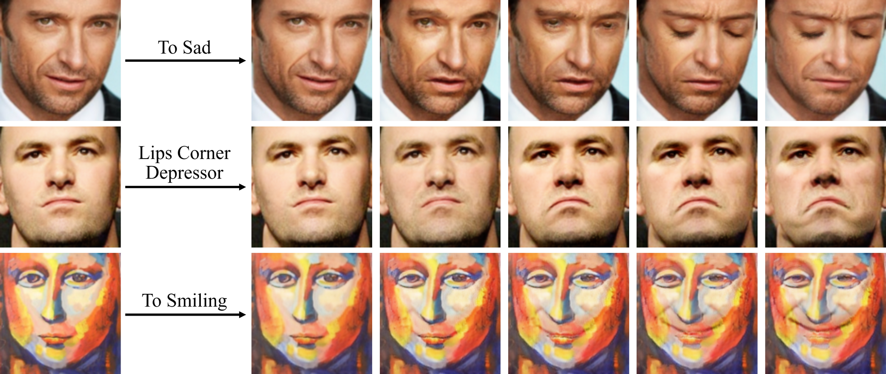

# Toward Fine-grained Facial Expression Manipulation (ECCV 2020, [Paper](https://arxiv.org/pdf/2004.03132.pdf))



**Arbitrary Facial Expression Manipulation**. Our model can 1) perform continuous editing between two expressions (top); 2) learn to only modify one facial component(middle); 3) transform expression in paintings (bottom). From left to right, the emotion intensity is set to 0, 0.5, 0.75, 1, and 1.25.


## Single/Multiple AU Editing

**Single/multiple au Editing**. AU4: Brow Lowerer; AU5: Upper Lid Raiser; AU7: Lid Tightener; AU12: Lip Corner Puller; AU15: Lip Corner Depressor; AU20: Lip Stretcher. The legend below the images are relative AUs intensity. The higher (lower) AUs value means to strengthen (weaken) the corresponding facial action unit in input image.


# More Results

**Arbitrary Facial Expresson Manipulation**. The top-left image with blue box is input, the images in odd rows are image with target expression, the images in even rows are animated results.


## Code coming soon...


## Citation
If you find this helpful, use this code or ideas from the paper for your research, please cite:

```bibtex
@inProceedings{ling2020finegrained,
  title     = {Toward Fine-grained Facial Expression Manipulation},
  author    = {Ling, Jun and Xue, Han and Song, Li and Yang, Shuhui and Xie, Rong and Gu, Xiao},
  booktitle = {Proceedings of European Conference on Computer Vision (ECCV)},
  year      = {2020}
}
```


## Contact
Please contact lingjun@sjtu.edu.cn or open an issue for any questions or suggestions.

 
## Acknowledgement
- Thanks [Albert Pumarola](https://www.albertpumarola.com/) for sharing his work [GANimation](https://github.com/albertpumarola/GANimation).
- Thansk the authors of [AffectNet](http://mohammadmahoor.com/affectnet/) for his work on large scale emotion database.
